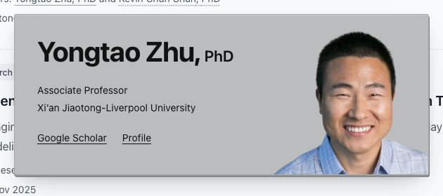
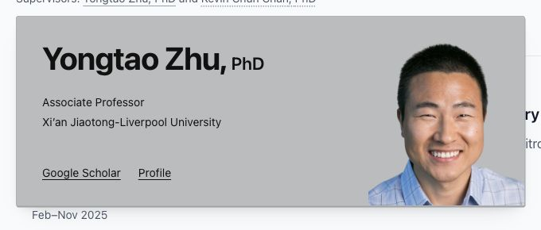

# Scholar card local acceptance — 2026-10-10

Local production preview: http://localhost:3001/research/

## Implemented

- Desktop cards: 640 × 240px. Responsive layout below 672px; 16px minimum viewport clearance. Mobile card height is 284px at tested 320, 390 and 600px widths.
- Matte surface; 1.5px bottom / 0.5px right paper edge, separate low-opacity floating shadow, reduced top highlight, retained 3px radius.
- Enter: 170ms opacity + 4px translation toward the final position from the trigger side. No scale. Exit: 110ms opacity only.
- Preserved 180ms hover opening and 220ms close grace. Reduced-motion CSS disables entry and exit transitions and translation.
- Shared popup, stable anchor for names in one paragraph, images preloaded/decoded, entire profile replaced atomically. No separate content fade.
- Existing names, roles, institutions, images, colors and links retained.

## Actual browser checks

Codex in-app browser, local production build. Responsive viewport overrides, not physical phones.

| Check                                           | Observed result                                                                                                                                                                                                                       |
| ----------------------------------------------- | ------------------------------------------------------------------------------------------------------------------------------------------------------------------------------------------------------------------------------------- |
| 1440px desktop, all three people                | 640 × 240px; complete text, loaded photos, accessible links.                                                                                                                                                                          |
| 320px narrow mobile, all three people           | 288 × 284px; complete text and photos; 16px left/right clearance; links wrap to separate rows.                                                                                                                                        |
| 390px mobile, all three people                  | 358 × 284px; complete text/photos; links fit on one row.                                                                                                                                                                              |
| 600px responsive boundary, all three people     | 568 × 284px; photos remain below the heading; no clipped head after adding the 180px portrait cap.                                                                                                                                    |
| 672px desktop breakpoint, longest name (Kevin)  | 640 × 240px; heading remains one line, no internal overflow.                                                                                                                                                                          |
| Bottom entry                                    | Initial computed transform `matrix(1, 0, 0, 1, 0, -4)`, opacity 0, 170ms duration; settles to opacity 1 / no transform.                                                                                                               |
| Top entry at 1440 × 600                         | Initial computed transform `matrix(1, 0, 0, 1, 0, 4)`; top moves from 242 to 238px, leaving 10px from the trigger; opacity settles at 1.                                                                                              |
| Exit                                            | Computed transition `opacity 0.11s ease-out`; transform stays `none`; popup unmounts.                                                                                                                                                 |
| Eight rapid alternating clicks on Yongtao/Kevin | One popup ID, identical 640 × 240px bounds at x256/y522, opacity 1 and no transform throughout sampled updates; matching names/photos, all images complete. See `switch-results.json`.                                                |
| Six brief pointer entries/exits                 | No popup during samples or after the delayed check. Pointer movement used native secondary clicks because this browser API does not expose a standalone hover command.                                                                |
| Sustained pointer entry/exit                    | Initially no popup; opens after delay. Immediately after exit it remains open, then disappears with no residue. Observed tool timings ~228ms opening and ~422ms closing include tool/poll overhead, not exact animation measurements. |
| Pointer bridge and external link                | Pointer moved from Kevin's name into the card; card remained open. Clicking Profile opened a new tab with the XJTLU Chun Chan profile. Temporary destination tab closed after verification.                                           |
| Keyboard                                        | Enter opens; Google Scholar receives visible focus; Tab moves to Profile with a 2px focus outline; Escape closes and restores focus to Kevin's trigger.                                                                               |
| Lint/build                                      | Yarn 3.6.1 lint and production build both exited 0; 73 pages generated. Existing punycode deprecation and TypeScript project-reference warnings remain.                                                                               |

## Verification limits

- The browser exposes no reduced-motion emulation. The media-query rules (including exit-selector specificity) were reviewed, but the system preference was not toggled: **reduced-motion behavior is not runtime verified**.
- Mobile checks used viewport sizes and mouse/keyboard interaction, not a physical touchscreen or Mobile Safari.
- Link destinations and `_blank` / `noopener noreferrer` behavior were retained. Kevin's institutional profile was actually opened; the other external destinations were not individually opened in this run.
- Switching and hover checks sample rendered states; they are not a frame-by-frame recording.
- Local only: no commit, push or deployment.

## Before / after screenshots

Desktop screenshots retain their original pixel scale, so the previous 700/590/640px width differences are visible. Mobile before/after pairs are at 320px. Additional 390px, 600px and top-placement screenshots are in `screenshots/`.

### Lianjun Zhang

| Desktop before                                    | Desktop after                                   |
| ------------------------------------------------- | ----------------------------------------------- |
|  |  |

| Mobile before                                    | Mobile after                                   |
| ------------------------------------------------ | ---------------------------------------------- |
|  |  |

### Yongtao Zhu

| Desktop before                                    | Desktop after                                   |
| ------------------------------------------------- | ----------------------------------------------- |
|  |  |

| Mobile before                                    | Mobile after                                   |
| ------------------------------------------------ | ---------------------------------------------- |
|  |  |

### Kevin Chun Chan

| Desktop before                                  | Desktop after                                 |
| ----------------------------------------------- | --------------------------------------------- |
|  |  |

| Mobile before                                  | Mobile after                                 |
| ---------------------------------------------- | -------------------------------------------- |
|  |  |
