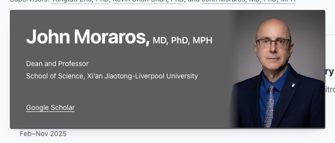

# John Moraros addition

Added after Yongtao Zhu and Kevin Chun Chan in the iGEM supervisors list. The shared experience data also supplies the related project detail pages.

- Name: John Moraros
- Degrees: MD, PhD, MPH
- Title: Dean and Professor
- Institution: School of Science, Xi’an Jiaotong-Liverpool University
- Google Scholar: https://scholar.google.com/citations?hl=en&user=lGXRCNgAAAAJ
- Institutional Profile: omitted; the former URL returned HTTP 404.

The supplied original JPEG was copied unchanged to `public/static/images/people/john-moraros.jpg` (1000 × 1000). A built-in imagegen background-extraction attempt was rejected by the tool's output safety system, so no generated image was used. The original photograph is displayed with CSS edge fades. CLI fallback was not used; it would require separate authorization and OPENAI_API_KEY.

## Actual checks

- Lint and production build both passed (73 pages).
- Desktop 1440px: 640 × 240px card, name/degrees on one line, no overflow.
- Mobile 320px: 288 × 284px card, degrees wrap completely onto a second line; no text/photo overlap.
- Mobile 390px: 358 × 284px card, complete name, degrees, institution and photo.
- Narrow 600px: 568 × 284px card, photo head and text remain visible.
- Six rapid switches among Yongtao, Kevin and John: identical card position and size, correct loaded portrait/name, opacity 1, no replayed transform.
- Keyboard Enter opens and focuses Google Scholar; Escape closes and restores focus to John's name.
- No browser errors observed. Responsive tests used browser viewport sizes, not physical devices.
- Only local preview; no commit or deployment.

The Google Scholar ID is linked from [his public personal profile](https://ca.linkedin.com/in/john-moraros-3bb22242). School and role context is also documented in [XJTLU's speaker biography](https://www.xjtlu.edu.cn/en/events/2023/03/obesityaglobalandcanadianchineseperspective). The Google Scholar destination itself could not be fetched by the research tool in this run.

## Screenshots

